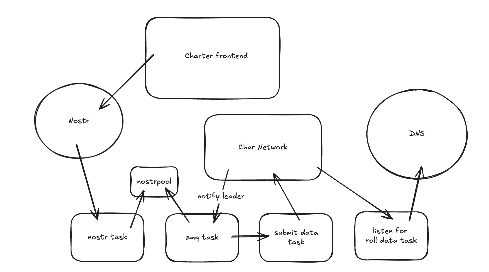

# plebfi_demo

## DNS over char



## Char bond signet example
`9cb47813b230b81cb468da40ff30ed0115bfbb38a38537e4ef8b360a2a9e3463`

## Setup Char Node

This guide details the process of initializing the `char-bitcoin` daemon, configuring the wallet, creating a bond, and registering an application.

### 1. Build char with ZMQ
```bash
cmake -DWITH_ZMQ=ON -B build
cmake --build build -- -j6
```

### 2. Define Alias and Start Node
define the alias for the `bitcoind` executable with the necessary flags for the Char protocol (Regtest mode).

> **Note:** Replace `<datadir>` with the actual path where you want to store your blockchain data.

```bash
# Define the alias
alias char_bitcoin='<char_install_location>/build/bin/bitcoind \
  -regtest \
  -char_node \
  -charbondindex \
  -datadir=<datadir> \
  -fallbackfee=0.00001 \
  -maxtxfee=1000 \
  -acceptnonstdtxn=1 \
  -server=1 \
  -txindex=1 \
  -rpcbind=0.0.0.0 \
  -rpcallowip=0.0.0.0/0 \
  -port=18444 \
  -rpcport=18443 \
  -debug=zmq \
  -daemon \
  -zmqpubleader=tcp://127.0.0.1:28332'

# Start the node
char_bitcoin
```

### 3. Wallet Initialization & Funding
Create a new wallet named "char" and mine 101 blocks to generate the initial coin supply (maturity requires 100 blocks).

```bash
# Create the wallet
bitcoin-cli createwallet "char"

# Fund the wallet (mine 101 blocks to a new address)
bitcoin-cli generatetoaddress 101 "$(bitcoin-cli getnewaddress)"
```

### 4. Create and Activate Bond
Generate a Taproot output specifically for a Char bond, then mine blocks to confirm and activate it.

```bash
# Create the bond output (Amount: 1 BTC)
bitcoin-cli walletcreatetaprootoutputforcharbond 1

# Activate the bond (mine 7 blocks to confirm)
bitcoin-cli generatetoaddress 7 "$(bitcoin-cli getnewaddress)"
```

### 5. App Registry Configuration
Register your application to the registry and configure its schedule.

* **App Hex:** `17f24e073d4eb05ef1779b2ea4c9895e7ad0d25e08d188ef5818aa9e1112f5ef`
* **App Name:** `char_dns`

```bash
# Add application to registry
bitcoin-cli add_app_to_app_registry 17f24e073d4eb05ef1779b2ea4c9895e7ad0d25e08d188ef5818aa9e1112f5ef "char_dns"

# Configure schedule
bitcoin-cli config_app_registry_schedule 17f24e073d4eb05ef1779b2ea4c9895e7ad0d25e08d188ef5818aa9e1112f5ef true
```


### PowerDNS setup on macOS (Homebrew + SQLite backend)

---

### 1. Install PowerDNS (authoritative server)

    brew install pdns

---

### 2. Create pdns.conf
    cat <<EOF | sudo tee /opt/homebrew/etc/powerdns/pdns.conf
    # Use SQLite as the backend
    launch=gsqlite3
    gsqlite3-database=/opt/homebrew/var/pdns/pdns.sqlite3

    # Enable the HTTP API for programmatic updates
    api=yes
    api-key=supersecretkey

    # Enable the internal web server (required for the API)
    webserver=yes
    webserver-address=127.0.0.1
    webserver-port=8081

    # DNS listener
    local-address=127.0.0.1
    local-port=5300

    # Logging
    loglevel=4
    EOF

---

### 3. Start PowerDNS

    sudo brew services start pdns

---

### 4. Reset the .nostr zone (optional clean slate)

    curl -X DELETE \
      -H "X-API-Key: supersecretkey" \
      http://127.0.0.1:8081/api/v1/servers/localhost/zones/nostr.

---

### 5. Create a new empty .nostr zone

    curl -X POST \
      -H "X-API-Key: supersecretkey" \
      -H "Content-Type: application/json" \
      -d '{
            "name": "nostr.",
            "kind": "Native",
            "masters": [],
            "nameservers": ["ns1.nostr."]
          }' \
      http://127.0.0.1:8081/api/v1/servers/localhost/zones


---

### 6. Check records

    curl -s -H "X-API-Key: supersecretkey" \
      http://127.0.0.1:8081/api/v1/servers/localhost/zones/nostr. | jq


---
